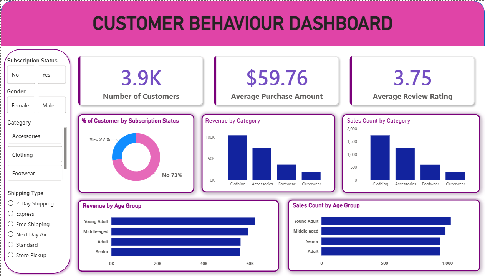

# 🚀 Data Analytics Portfolio Project  
### Transforming Raw Data into Actionable Insights

<p align="center">
  
</p>

---

## 📌 Overview
This project presents a **complete end-to-end data analytics pipeline**, demonstrating the ability to extract meaningful insights from raw data and communicate them effectively through dashboards and reports.

The workflow covers:
- Data ingestion and preprocessing  
- Exploratory Data Analysis (EDA)  
- SQL-based data querying  
- Interactive dashboard creation  
- Insight-driven reporting  

---

## 📂 Dataset
- Structured dataset containing customer behavior and transactional data  
- Includes both **categorical** and **numerical** features  
- Required preprocessing due to missing values and inconsistencies  

---

## 🛠️ Tech Stack

| Category            | Tools Used |
|--------------------|-----------|
| Programming        | Python |
| Libraries          | Pandas, NumPy, Matplotlib, Seaborn |
| Database           | PostgreSQL / MySQL / SQL Server |
| Visualization      | Power BI |
| Presentation       | Gamma |
| Environment        | Jupyter Notebook / VS Code |

---

## 🔄 Project Workflow

### 1️⃣ Data Loading & Understanding
- Imported dataset using **Pandas**
- Performed schema inspection and summary statistics

### 2️⃣ Exploratory Data Analysis (EDA)
- Identified trends, correlations, and distributions  
- Visualized data using histograms, heatmaps, and bar charts  

### 3️⃣ Data Cleaning
- Handled missing values and duplicates  
- Standardized formats and corrected inconsistencies  

### 4️⃣ SQL Analysis
- Loaded cleaned data into relational databases  
- Performed:
  - Aggregations (SUM, AVG, COUNT)  
  - Joins and filtering  
  - Business insight queries  

### 5️⃣ Dashboard Development
- Built an interactive **Power BI dashboard**
- Included:
  - KPI cards  
  - Trend analysis  
  - Category-wise comparisons  
  - Filters for dynamic exploration  

---

## 📊 Dashboard Preview

<p align="center">
  
</p>

---

## 📈 Key Insights
- Identified high-value customer segments  
- Discovered purchasing patterns and seasonal trends  
- Highlighted key performance drivers  
- Provided actionable recommendations for decision-making  

---

## 📑 Reports & Presentation
- 📄 Detailed analytical report summarizing findings  
- 📊 Professional presentation created using **Gamma**  
- Focused on clarity, storytelling, and business impact  

---

## ▶️ How to Run

### 🔧 Prerequisites
```bash
pip install pandas numpy matplotlib seaborn
```

- Install PostgreSQL / MySQL / SQL Server  
- Install Power BI Desktop  

---

### ⚙️ Steps
```bash
# Clone the repository
git clone <https://github.com/aryantbtn/customer_trend_analysis.git>

# Navigate to project folder
cd data-analytics-project

# Launch Jupyter Notebook
jupyter notebook
```

- Run EDA notebooks  
- Execute SQL scripts from `/sql` folder  
- Open `.pbix` file in Power BI  
- Review report and presentation  

---

## 🧠 Skills Demonstrated
- Data Cleaning & Preprocessing  
- Exploratory Data Analysis  
- SQL Query Optimization  
- Data Visualization & Storytelling  
- Business Insight Generation  

---

## 🌟 Project Highlights
✔ End-to-end analytics pipeline  
✔ Real-world business problem solving  
✔ Interactive dashboard for stakeholders  
✔ Clean, structured, and scalable workflow  

---

## 📬 Contact
- 📧 Email: aryansinghal705@gmail.com  
- 💼 LinkedIn: https://www.linkedin.com/in/aryan-singhal-a072a4295/
- 🧑‍💻 GitHub: https://github.com/aryantbtn

---

## ⭐ If you found this project useful, consider giving it a star!
